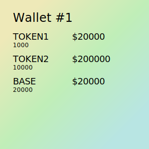

# Portfolio NFT

Allows the minter to track their ERC-20 token balances and USD values in an on-chain SVG 
without relying on any third parties.



## Usage

```
yarn install
```
```
npx hardhat test
```

## Deployment
WIP
